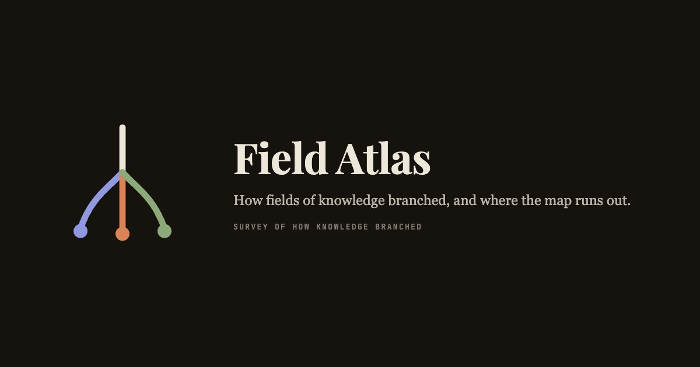

<p align="center">
  
</p>

<p align="center">
  <a href="https://andifathulms.github.io/field-atlas/"><strong>Read the atlas →</strong></a>
</p>

<p align="center">
  <a href="https://github.com/andifathulms/field-atlas/actions/workflows/deploy.yml"></a>
  
  
  
</p>

---

**Field Atlas** is a read-only narrative atlas of how knowledge split into fields. Each field page
tells the story of one subject: where it branched from, the dated turning points that forced the
split, the people who were there, and the questions it still cannot answer.

- **Maps, not timelines.** Lineage is a DAG — a field can be born at the seam of two parents — so
  each thread is drawn as a branching map with the turning points hung along the branch.
- **Dated turning points.** 604 of them, each with sources. Contested ones are marked as contested
  and say what is disputed, rather than picking a side.
- **The fog is drawn.** 121 open problems, rendered as branches that fade into dashes: the atlas
  shows its own edge instead of pretending the map is finished.

## What is surveyed

| Domain | Threads | Fields |
| --- | --- | --- |
| **Mathematics** | Geometry, Number Theory, Analysis, Foundations, Algebra, Combinatorics, Dynamics, Statistics, Computation | 49 |
| **Physics** | Relativity, Entropy, Quantum, Stars, Matter, Nuclear | 30 |
| **Biology** | Heredity, Cell, Brain, Ecology, Development | 25 |

Every field carries an *A Closer Look* chapter: one worked example or key argument with real
numbers, so the central idea is seen working rather than described.

## Beyond the field pages

| Page | What it answers |
| --- | --- |
| [`/crossings`](https://andifathulms.github.io/field-atlas/crossings/) | Where a result proved in one domain lands in another |
| [`/people`](https://andifathulms.github.io/field-atlas/people/) | Everyone in the atlas, with the turning points they took part in |
| [`/toolkit`](https://andifathulms.github.io/field-atlas/toolkit/) | Which fields' ideas travelled furthest, by lineage and by use |
| [`/open-problems`](https://andifathulms.github.io/field-atlas/open-problems/) | The whole fog in one place, grouped by domain and thread |
| [`/search`](https://andifathulms.github.io/field-atlas/search/) | Fields, turning points, open problems, key ideas and people |

## Run locally

```bash
npm install
npm run dev        # http://localhost:3000
npm run build      # static export to out/
npm run lint       # eslint
npm run typecheck  # tsc --noEmit
```

## Editing content

One field is one Markdown file in `content/fields/`. YAML frontmatter holds the structured data —
parents, era, core question, turning points, open problems, key ideas, applications — and `## `
headings split the body into chapters, so chapter count and titles are free per field. Shared
figures live in `content/figures.json`.

```
content/
  fields/<field-id>.md   one field, one file — a correction is a single-file diff
  figures.json           people, each tied to the turning points they took part in
src/
  app/                   routes: /, /[domain], /[domain]/[field], /crossings, /people, …
  app/og/[...slug]/      the social card for every page, rendered to PNG at build time
  lib/content.ts         loads, derives and validates the whole graph
  lib/treeLayout.ts      the branching map's layered layout
```

The loader validates everything at build time: unknown or cross-domain parents, cycles, duplicate
turning-point ids, turning-point types outside the domain's vocabulary, contested points with no
note, and unresolved figure references all fail `npm run build` rather than shipping.

Corrections are a pull request that edits one file. There is no admin panel, no database and no
accounts.

## Sharing

Every page — each field, each domain, each index — has its own Open Graph card, drawn at build time
in the brand palette with the field's name, thread, core question, era and counts. Canonical and
social URLs are absolute, derived from the Pages origin the deploy workflow supplies, so a pasted
link unfurls correctly wherever it lands.

## Deploy

Pushing to `main` runs [`.github/workflows/deploy.yml`](.github/workflows/deploy.yml): it builds the
static export and publishes it to GitHub Pages, taking both the base path and the site origin from
the Pages configuration. In the repository settings, set **Pages → Source** to *GitHub Actions*.

## Stack

Next.js 14 (static export) · Tailwind CSS · d3-shape for the branching maps · KaTeX for mathematics
· `next/og` for the social cards. No backend, no client-side data fetching, no analytics.

## Documents

- [PRD.md](PRD.md) — what the atlas is for and what it refuses to be
- [DESIGN.md](DESIGN.md) — the visual identity: paper, ink, and one accent per domain
- [CLAUDE.md](CLAUDE.md) — build notes, the data model, and how the layout was arrived at
